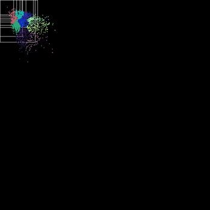

# Bears-n-Seals
This project is a collaboration between NOAA and XNOR AI.  The goal of this
project is to detect seals and polar bears in aerial imagery from different locations in the arctic.

All tools require Python2.7
## Data
All images were gathered from a plane flying ~1,000 feet above the ice.

* `_CHESS_ImagesSelected4Detection.csv` : All raw hotspot data.

The column schema is as follows(each record in unique):

* `hotspot_id`: unique ID
* `timestamp`: GMT/UTC timestamp (always corresponds to thermal image timestamp)
* `filt_thermal16`: Filename of the 16-bit PNG containing the raw FLIR image data
* `filt_thermal8`: Filename of the 8-bit JPG containing the annotated FLIR image data (hotspots circled)
* `filt_color`: Filename of the 8-bit JPG containing a color image taken at or near the same time as the thermal image. The timestamp encoded in the filename may be different from the thermal timestamp by up to 60 seconds (but typically less than 1 second).
* `x_pos`/`y_pos`: Location of the hotspot in the thermal image
* `thumb_*`: Bounding box of the hotspot in the color image. **NOTE**: some of these values are negative, as the bounding box is always 512x512 even if the hotspot is at the edge of the image.
* `hotspot_type`: "Animal" or "Anomaly", classified by human "Animal" (true positive) or "Anomaly" (false positive)
* `species_id`: "Bearded Seal", "Ringed Seal", "UNK Seal", "Polar Bear" or "NA" (for anomalies)

The file names for `filt_color, filt_thermal8, filt_thermal16`:

Example: `CHESS_FL1_C_160408_000946.314_THERM-16BIT.PNG`
* `[CHESS]` : project name
* `[FL1]` : plane tail number
* `[c]` : camera - plane caries 3 pairs of thermal and EO cameras
* `[160408]` : flight id
* `[000946.314]` : timestamp  - sometimes formatted like 000946.314GMT
* `[THERM-16BIT]` : image type = `[THERM-16BIT]` is for IR, `[COLOR-8-BIT]` is for RGB, `[THERM-8-bit]` is for thermal 8-bit

**NOTE:** timestamps are taken from thermal and applied to IR/therm image names

## Preprocessing/Data augmentation:
This script provides features to crop and augment images and generates bounding box labels in darknet/yolo label foramt.
The input csv file must be in the same format as `_CHESS_ImagesSelected4Detection.csv` in the root of this repo.
```usage src/preprocess.py

usage: preprocess.py

required arguments:
  --csv CSV      csv file: relative path to the seal image data csv file
                 (default: None)
  --imdir IMDIR  image dir: relative path to the directory containing all
                 images (default: None)
  --out OUT      out dir: relative path to the directory to store cropped
                 images (default: None)
                 
optional arguments:
  --bb BB        bounding box size: size of bounding box width and height
                 around the center point (default: 70)
  --min MIN      min shift: min value shift center point dx and dy, calculated
                 as random value between min and max (default: 100)
  --max MAX      max shift: max value shift center point dx and dy, calculated
                 as random value between min and max (default: 250)
  --cs CS        crop size: size of croped region (default: 512)
  --label LABEL  label: output file with all absolute label paths for training
                 (default: training_list.txt)
  -c             global seal class: puts all seals as one class (default:
                 False)
  -b             make bear labels (default: False)
  -a             make anomaly labels (default: False)
  -d             debug: draws bounding box bounds (default: False)
```

## Testing/Postprocess


###Info

[afsc.noaa.gov/News/iceseal_pop_assess.htm](https://www.afsc.noaa.gov/News/iceseal_pop_assess.htm)




Label anchors 9 clusters 1024x1024 
### Useful Commands:

Make test set of all color images:
* `ls -l /data/noaa/NOAA_ImagesForDetectionDevelopment/CHESS/*_COLOR-8-BIT.JPG > colorvalid.txt`

Get size of all 16 bit thermals
* `du -ch /data/noaa/NOAA_ImagesForDetectionDevelopment/CHESS/*THERM-16BIT.PNG | grep total`

Train, print append to text file
* `./darknet detector train cfg/seals_640.data cfg/seals_640.cfg ../darknet/darknet53.conv.74 | tee -a 640loss.out`
 
Test/Train Split:
* `head -n 500 rgb_640u.txt > ../seal-darknet/sealvalid_640.txt`
* `tail -n +500 rgb_640u.txt > ../seal-darknet/sealtrain_640.txt` 

Merge negatives w/training set:
* `cat rgb_640_train.txt ../potential_negs/labels4001-5000.txt | sort --random-sort > train_w_negs.txt`

Generate negative chips 640x640
* `convert -crop 640x640+1000+1000 -limit memory 1gb CHESS2016_N94S_FL1_C__201604072300* ../640_negs/cropped_%d.JPG`
* `for k in *.JPG; do convert $k -crop 640x640+1000+1000 -limit memory 2gb -limit  map 2gb -verbose ../640_negs/cropped_$k; done`

Generate training weights(Alexy's repo)
* `./darknet partial cfg/darknet_19.cfg darknet19_448.weights darknet19.conv.model 19`

Generat map score, calc anchors (Alexy's repo)
* `./darknet detector map cfg/bearsnseals.d`ata cfg/bearsnseals.cfg weights/backup.weights`
* `./darknet detector calc_anchors cfg/seals_640.data  -num_of_clusters 9 -width 640 -height 640`

Count # of class 1 in SVM dataset
* `cat ../dataset/test.txt | grep -c -P "^1.*$"`

rename 's/.PNG/_hotspots.PNG/' *.PNG
